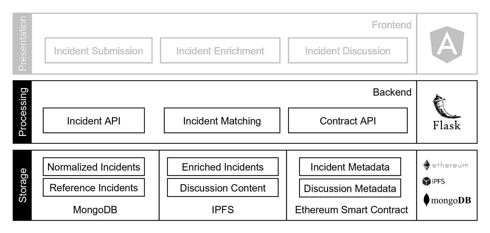

# BISCUIT Backend

*This repository is part of a research project on blockchain security incident reporting based on human observations. The research paper is currently under review.*

Security incidents in blockchain-based systems are frequent nowadays, which calls for more structured efforts in incident reporting and response. To improve the current status quo of reporting incidents on blogs and social media, we propose a decentralized incident reporting and discussion system.
This repository implements the associated backend, which connects the frontend/presentation layer to the various backend storage components (MongoDB, IPFS, Ethereum).

The following image higlights the app layers and architecture:



## Docker
You can run the entire project with docker-compose using the Compose file in the project root.

## Project setup

To run the backend by itself for debugging, first install dependencies
```
pip install -r requirements
```

Set up the contract in a local Ganache instance using Truffle.
The smart contract is located at https://github.com/biscuitsecurity/contract.

Then create a `.env` file based on `.env.example`. Grab a secret key from one of the default Ganache accounts.
The Mongo credentials assume you are using the prepared Mongo container from the Dockerfile.

Run the project using

```
export FLASK_APP=backend
flask run --host 0.0.0.0
```
Server runs locally via entering ```python app.py```at ```http://127.0.0.1:5000/```

## Tests

Unit tests for API, IPFS and Web3 interactions are located in the `tests` directory. They highlight expected usage and
provide maintainability for future changes.
