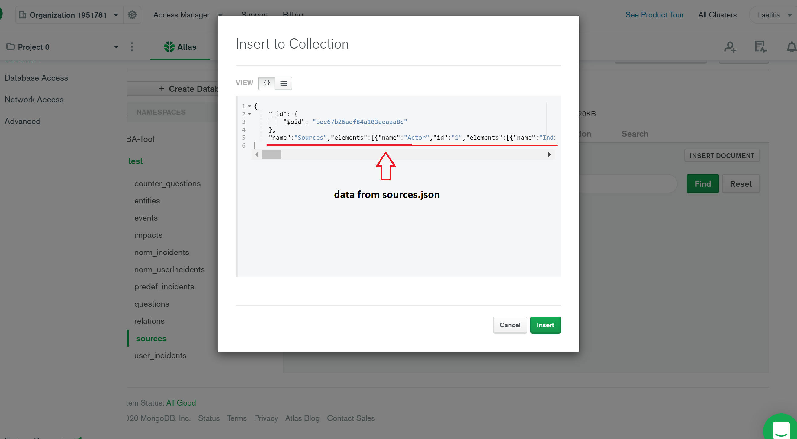

# Python Server

This project was created using [PyCharm - Community Edition](https://www.jetbrains.com/de-de/pycharm/download) and [Python 3.8](https://www.python.org/downloads/) as project interpreter.

## Set up the MongoDB
- Create Database 
- Create necessary collection "sources" & fill it with the data from data/sources.json

- Create necessary collection "events" & fill it with the data from data/events.json
- Create necessary collection "entities" & fill it with the data from data/entities.json
- Create necessary collection "impacts" & fill it with the data from data/impacts.json

Update the database-url and the database-name in app.py to enable the connection the MongoDB you've just created.

## Configurations to run the server locally
Following packages are necessary to run the project: 
- json
- scipy
- nltk
- random
- bson
- numpy
- flask
- flask-cors
- flask-pymongo
- spacy

Server runs locally via entering ```python app.py```at ```http://127.0.0.1:5000/```
